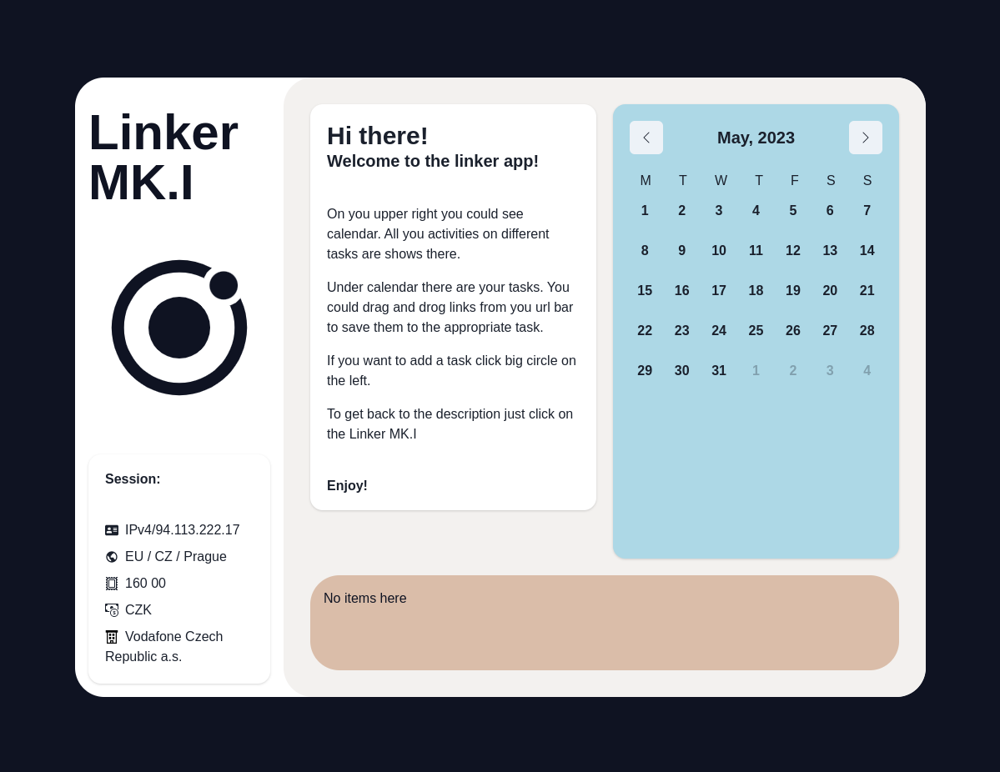

## Linker app

### Motivation
    Successfully pass the KAJ.
### Progress: 

##### Points to improve:
1) Global state management is not functioning properly as useContext is being used without adequate memoization.
2) The styles appear disorganized due to rapid prototyping and frequent changes.

##### Solution:
1) Implement memoization for components or utilize specialized global state management tools like React.
2) Migrate CSS styles to ChakraUI components.

##### Functionality:
Tasks could be added with a form. You could track particular tasks time with a timer.

##### Start state:

##### Add task:

<video width="500"> 
    <source src="./public/addtask.webm" type="video/webm">
</video>
